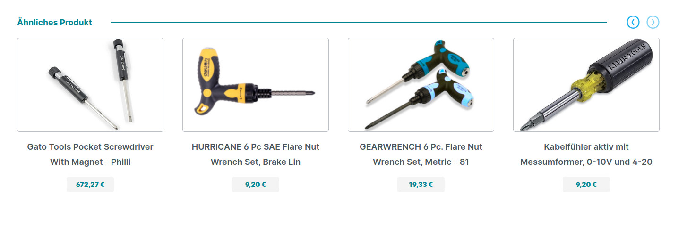
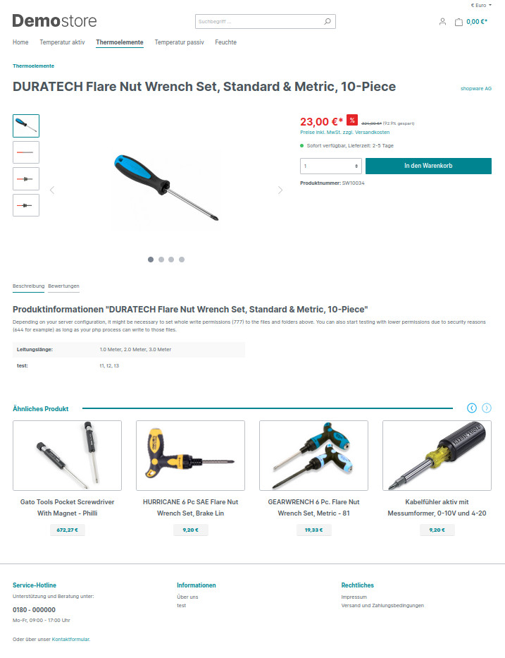

# Shopware 6 Related Products Carousel Plugin

After the plugin installation, you can have related products end of the product details page.

*Related products carousel*

### Configuration

If you are using a specific plugin theme, just put this block at the end of the ` ` block in the
`Resources\views\storefront\page\product-detail\index.html.twig` file:

### Block

<pre>

    
        
            
                
            
        
  
</pre>

### Example
<pre>



    {{ parent() }}




    
        {{ parent() }}
    

    

        
            
            
                
            
        

    


</pre>

